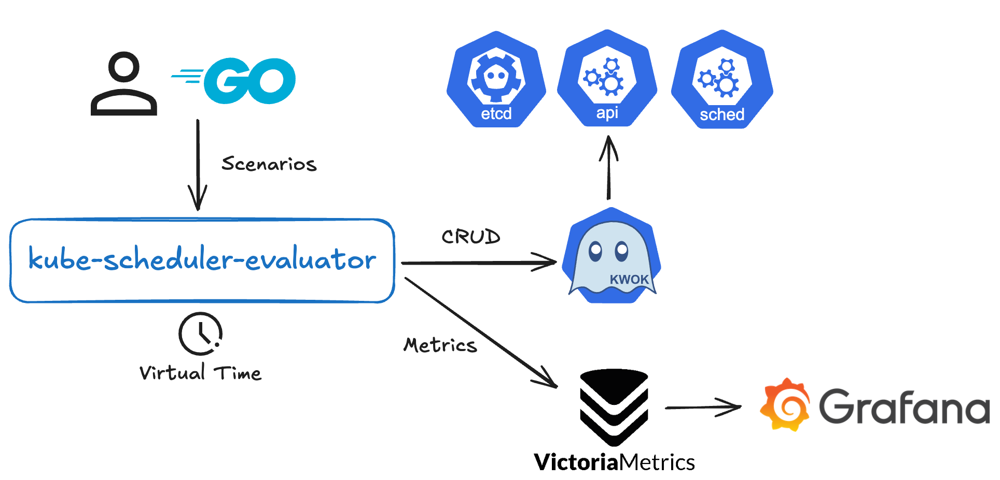

# kube-scheduler-evaluator Reference Implementation

kube-scheduler-evaluator-reference enables you to run reference scenarios locally using [kube-scheduler-evaluator](https://github.com/pfnet/kube-scheduler-evaluator) and docker-compose.

## Quick Start

```bash
git clone https://github.com/pfnet/kube-scheduler-evaluator-reference.git
cd kube-scheduler-evaluator-reference

make  # Up and run evaluation
open http://localhost:3000  # Grafana dashboard

make clean # Stop and clean up
```

## Scenarios

The kube-scheduler-evaluator-reference implements the following scenarios:

- example: A simple scenario that includes an explanation of how to create your own scenario.
- clusterdata: A scenario for replaying trace data from [alibaba/clusterdata](https://github.com/alibaba/clusterdata).

## Architecture

The kube-scheduler-evaluator-reference uses kwok to simulate operations like creating and deleting objects such as Nodes, Pods, and Jobs.
It receives multiple scenarios defined in Go from the user, executes CRUD operations on objects against kwok while managing virtual time, and simultaneously sends metrics to time-series databases like Victoria Metrics.



## 謝辞

この成果は、国立研究開発法人新エネルギー・産業技術総合開発機構（ＮＥＤＯ）の
「ポスト５Ｇ情報通信システム基盤強化研究開発事業」（JPNP20017）の委託事業の結果得られたものです。
